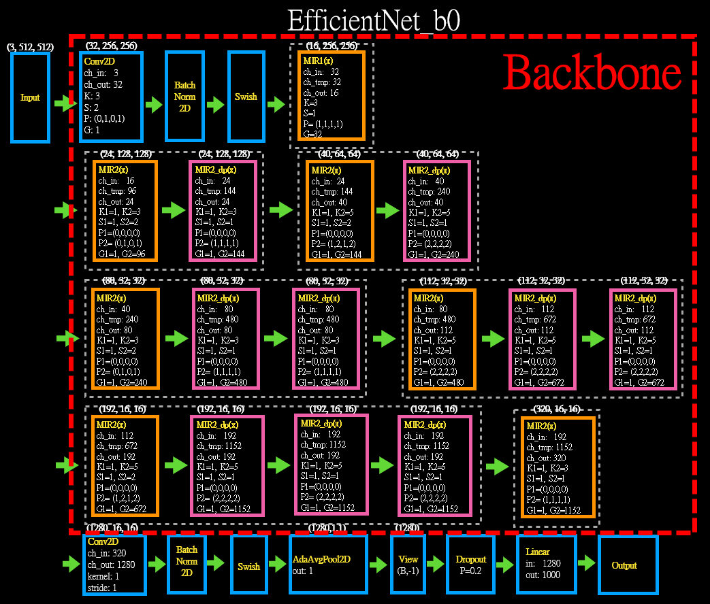

# Yolov4 with Efficientnet b0-b7 Backbone
## 目的:
##### 這邊嘗試著以 EfficientNet b0-b7 將 Yolov4 的 backbone 做替換來看看會有怎樣的訓練趨勢。
***
## Backbone 替換
Yolov4:  


***
## yaml 檔修改
##### 原始的 Yolov4_L yaml 檔案的 backbone

##### 修改後的 Yolov4_L_Efficientnet_b0 yaml
  
##### 修改後的 Yolov4_L_Efficientnet_b1 yaml
  
##### 修改後的 Yolov4_L_Efficientnet_b2 yaml
  
##### 修改後的 Yolov4_L_Efficientnet_b3 yaml
  
##### 修改後的 Yolov4_L_Efficientnet_b4 yaml
  
##### 修改後的 Yolov4_L_Efficientnet_b5 yaml
  
##### 修改後的 Yolov4_L_Efficientnet_b6 yaml
  
##### 修改後的 Yolov4_L_Efficientnet_b7 yaml
  

***
## 程式修改
### yolo.py, parse_model() 增加
```
eff_n=n
elif m is CBS:
    c1=ch[f if f<0 else f+1]
    c2=args[0]
    args=[c1,c2,*args[1:]]
elif m is effLayer:
    c1=ch[f if f<0 else f+1]
    c2=args[0]
    args=[c1,c2,eff_n,*args[1:]]
```
### common.py 增加
```
class CBS(nn.Module):
    def __init__(self, c1, c2, k, s, s_count=0, bnum='b'):
        super(CBS, self).__init__()
        image_sizes={'b0':224,'b1':240,'b2':260,'b3':300,'b4':380,'b5':456,'b6':528,'b7':600}
        if s_count>1:
            image_size=int(image_sizes[bnum]/(2**s_count))
        else:
            image_size=image_sizes[bnum]
        Conv2d = get_same_padding_conv2d(image_size=image_size)
        self.conv=Conv2d(c1, c2, kernel_size=k, stride=s, bias=False)
        self.bn = nn.BatchNorm2d(c2)
        self.swish = MemoryEfficientSwish()
    def forward(self, x):
        x=self.swish(self.bn(self.conv(x)))
        return x

class effBlock(nn.Module):
    def __init__(self, c1, c2, k=1, s=1, exp_r=1, se_r=None, image_size=0): #chin, plane, block_nums, group, width_per_group
        super(effBlock,self).__init__()
        self.expansion_ratio=exp_r
        self.has_se = (se_r is not None) and (0 < se_r <= 1)
        self.ch_in=c1
        self.ch_tmp=c1*exp_r
        self.ch_out=c2
        self.stride=s

        # Expansion phase (Inverted Bottleneck)
        oup = self.ch_tmp  # number of output channels
        if self.expansion_ratio != 1:
            Conv2d = get_same_padding_conv2d(image_size=image_size)
            self._expand_conv = Conv2d(in_channels=self.ch_in, out_channels=self.ch_tmp, kernel_size=1, bias=False)
            self._bn0 = nn.BatchNorm2d(num_features=self.ch_tmp)

        # Depthwise convolution phase
        Conv2d = get_same_padding_conv2d(image_size=image_size)
        self._depthwise_conv = Conv2d(in_channels=self.ch_tmp, out_channels=self.ch_tmp, groups=self.ch_tmp, kernel_size=k, stride=s, bias=False)
        self._bn1 = nn.BatchNorm2d(num_features=self.ch_tmp)
        image_size = calculate_output_image_size(image_size, s)

        # Squeeze and Excitation layer, if desired
        if self.has_se:
            Conv2d = get_same_padding_conv2d(image_size=(1, 1))
            num_squeezed_channels = max(1, int(self.ch_in * se_r))
            self._se_reduce = Conv2d(in_channels=self.ch_tmp, out_channels=num_squeezed_channels, kernel_size=1)
            self._se_expand = Conv2d(in_channels=num_squeezed_channels, out_channels=self.ch_tmp, kernel_size=1)

        # Pointwise convolution phase
        Conv2d = get_same_padding_conv2d(image_size=image_size)
        self._project_conv = Conv2d(in_channels=self.ch_tmp, out_channels=self.ch_out, kernel_size=1, bias=False)
        self._bn2 = nn.BatchNorm2d(num_features=self.ch_out)
        self._swish = MemoryEfficientSwish()

    def forward(self, inputs, drop_connect_rate=None):
        #print('effBlock forward...')
        # Expansion and Depthwise Convolution
        x = inputs
        #print('x0: ',x.size())
        if self.expansion_ratio != 1:
            x = self._expand_conv(inputs)
            x = self._bn0(x)
            x = self._swish(x)

        x = self._depthwise_conv(x)
        x = self._bn1(x)
        x = self._swish(x)
        #print('x1: ',x.size())
        # Squeeze and Excitation
        if self.has_se:
            x_squeezed = F.adaptive_avg_pool2d(x, 1)
            x_squeezed = self._se_reduce(x_squeezed)
            x_squeezed = self._swish(x_squeezed)
            x_squeezed = self._se_expand(x_squeezed)
            x = torch.sigmoid(x_squeezed) * x

        # Pointwise Convolution
        x = self._project_conv(x)
        x = self._bn2(x)
        #print('x2: ',x.size())
        # Skip connection and drop connect
        if self.stride == 1 and self.ch_in == self.ch_out:
            # The combination of skip connection and drop connect brings about stochastic depth.
            if drop_connect_rate:
                x = drop_connect(x, p=drop_connect_rate)
            x = x + inputs  # skip connection
        #print('x3: ',x.size())
        return x

class effLayer(nn.Module):
    def __init__(self, c1, c2, n=1, k=1, s=1, s_count=0, exp_r=1, se_r=1, bnum=0, md='b'): #chin, plane, block_nums, group, width_per_group
        super(effLayer,self).__init__()
        params_dict = {'b0': (1.0, 1.0, 224, 0.2),
                       'b1': (1.0, 1.1, 240, 0.2),
                       'b2': (1.1, 1.2, 260, 0.3),
                       'b3': (1.2, 1.4, 300, 0.3),
                       'b4': (1.4, 1.8, 380, 0.4),
                       'b5': (1.6, 2.2, 456, 0.4),
                       'b6': (1.8, 2.6, 528, 0.5),
                       'b7': (2.0, 3.1, 600, 0.5)}
        width_coef, depth_coef, image_size, dropout_rate = params_dict[md]
        
        self.global_params = GlobalParams(
                                        width_coefficient=width_coef,
                                        depth_coefficient=depth_coef,
                                        image_size=image_size,
                                        dropout_rate=dropout_rate,
                                        num_classes=1000,
                                        batch_norm_momentum=0.99,
                                        batch_norm_epsilon=1e-3,
                                        drop_connect_rate=0.2,
                                        depth_divisor=8,
                                        min_depth=None,
                                        include_top=True,
                                    )

        self.block_number=bnum
        if s==2:
            image_size = calculate_output_image_size(self.global_params.image_size, 2**(s_count-1))
        else:
            image_size = calculate_output_image_size(self.global_params.image_size, 2**s_count)

        self.blocks = nn.ModuleList([effBlock(c1, c2, k, s, exp_r, se_r, image_size)])
        image_size = calculate_output_image_size(image_size, s)
        for _ in range(n - 1):
                self.blocks.append(effBlock(c2, c2, k, 1, exp_r, se_r, image_size))

    def forward(self, x):
        for idx, block in enumerate(self.blocks):
            drop_connect_rate = self.global_params.drop_connect_rate
            if drop_connect_rate:
                drop_connect_rate *= float(idx+self.block_number) / 16  # scale drop connect_rate # Total blocks of efficientnet is 16
                #print(f'*** bnum: {idx}, drop connect rate: {drop_connect_rate}')
            x = block(x, drop_connect_rate=drop_connect_rate)
        return x
```
***
## parameter 變化量
### 原始的 Yolov4_S
```
                 from  n    params  module                                  arguments
  0                -1  1       464  models.common.Conv                      [3, 16, 3, 1]
  1                -1  1      4672  models.common.Conv                      [16, 32, 3, 2]
  2                -1  1      5216  models.common.Bottleneck                [32, 32]
  3                -1  1     18560  models.common.Conv                      [32, 64, 3, 2]
  4                -1  1     19904  models.common.BottleneckCSP             [64, 64, 1]
  5                -1  1     73984  models.common.Conv                      [64, 128, 3, 2]
  6                -1  1    161152  models.common.BottleneckCSP             [128, 128, 3]
  7                -1  1    295424  models.common.Conv                      [128, 256, 3, 2]
  8                -1  1    641792  models.common.BottleneckCSP             [256, 256, 3]
  9                -1  1   1180672  models.common.Conv                      [256, 512, 3, 2]
 10                -1  1   1248768  models.common.BottleneckCSP             [512, 512, 1]
 11                -1  1   1904640  models.common.SPPCSP                    [512, 256, 1]
 
 Model Summary: 226 layers, 9.12461e+06 parameters, 9.12461e+06 gradients
```
### 原始的 Yolov4_L
```
                 from  n    params  module                                  arguments
  0                -1  1       928  models.common.Conv                      [3, 32, 3, 1]
  1                -1  1     18560  models.common.Conv                      [32, 64, 3, 2]
  2                -1  1     20672  models.common.Bottleneck                [64, 64]
  3                -1  1     73984  models.common.Conv                      [64, 128, 3, 2]
  4                -1  1    119936  models.common.BottleneckCSP             [128, 128, 2]
  5                -1  1    295424  models.common.Conv                      [128, 256, 3, 2]
  6                -1  1   1463552  models.common.BottleneckCSP             [256, 256, 8]
  7                -1  1   1180672  models.common.Conv                      [256, 512, 3, 2]
  8                -1  1   5843456  models.common.BottleneckCSP             [512, 512, 8]
  9                -1  1   4720640  models.common.Conv                      [512, 1024, 3, 2]
 10                -1  1  12858368  models.common.BottleneckCSP             [1024, 1024, 4]
 11                -1  1   7610368  models.common.SPPCSP                    [1024, 512, 1]
Model Summary: 334 layers, 5.25155e+07 parameters, 5.25155e+07 gradients
```
### 修改後的 Yolov4_Efficientnet_b0:
```
                 from  n    params  module                                  arguments
  0                -1  1       928  models.common.CBS                       [3, 32, 3, 2, 1, 'b0']
  1                -1  1      1448  models.common.effLayer                  [32, 16, 1, 3, 1, 1, 1, 0.25, 0, 'b0']
  2                -1  2     16714  models.common.effLayer                  [16, 24, 2, 3, 2, 2, 6, 0.25, 1, 'b0']
  3                -1  2     46640  models.common.effLayer                  [24, 40, 2, 5, 2, 3, 6, 0.25, 3, 'b0']
  4                -1  3    242930  models.common.effLayer                  [40, 80, 3, 3, 2, 4, 6, 0.25, 5, 'b0']
  5                -1  3    543148  models.common.effLayer                  [80, 112, 3, 5, 1, 4, 6, 0.25, 8, 'b0']
  6                -1  4   2026348  models.common.effLayer                  [112, 192, 4, 5, 2, 5, 6, 0.25, 11, 'b0']
  7                -1  1    717232  models.common.effLayer                  [192, 320, 1, 3, 1, 5, 6, 0.25, 15, 'b0']
  8                -1  1    412160  models.common.CBS                       [320, 1280, 1, 1, 5, 'b0']
  9                -1  1   7872512  models.common.SPPCSP                    [1280, 512, 1]
Model Summary: 349 layers, 3.0059e+07 parameters, 3.0059e+07 gradients
```  
### 修改後的 Yolov4_Efficientnet_b1:
```
                 from  n    params  module                                  arguments
  0                -1  1       928  models.common.CBS                       [3, 32, 3, 2, 1, 'b1']
  1                -1  2      2060  models.common.effLayer                  [32, 16, 2, 3, 1, 1, 1, 0.25, 0, 'b1']
  2                -1  3     27424  models.common.effLayer                  [16, 24, 3, 3, 2, 2, 6, 0.25, 1, 'b1']
  3                -1  3     77930  models.common.effLayer                  [24, 40, 3, 5, 2, 3, 6, 0.25, 3, 'b1']
  4                -1  4    345830  models.common.effLayer                  [40, 80, 4, 3, 2, 4, 6, 0.25, 5, 'b1']
  5                -1  4    751720  models.common.effLayer                  [80, 112, 4, 5, 1, 4, 6, 0.25, 8, 'b1']
  6                -1  5   2614300  models.common.effLayer                  [112, 192, 5, 5, 2, 5, 6, 0.25, 11, 'b1']
  7                -1  2   2280832  models.common.effLayer                  [192, 320, 2, 3, 1, 5, 6, 0.25, 15, 'b1']
  8                -1  1    412160  models.common.CBS                       [320, 1280, 1, 1, 5, 'b1']
  9                -1  1   7872512  models.common.SPPCSP                    [1280, 512, 1]
Model Summary: 437 layers, 3.25646e+07 parameters, 3.25646e+07 gradients
```  
### 修改後的 Yolov4_Efficientnet_b2:
```
                 from  n    params  module                                  arguments
  0                -1  1       928  models.common.CBS                       [3, 32, 3, 2, 1, 'b2']
  1                -1  2      2060  models.common.effLayer                  [32, 16, 2, 3, 1, 1, 1, 0.25, 0, 'b2']
  2                -1  3     27424  models.common.effLayer                  [16, 24, 3, 3, 2, 2, 6, 0.25, 1, 'b2']
  3                -1  3    103134  models.common.effLayer                  [24, 48, 3, 5, 2, 3, 6, 0.25, 3, 'b2']
  4                -1  4    421550  models.common.effLayer                  [48, 88, 4, 3, 2, 4, 6, 0.25, 5, 'b2']
  5                -1  4    862768  models.common.effLayer                  [88, 120, 4, 5, 1, 4, 6, 0.25, 8, 'b2']
  6                -1  5   3048878  models.common.effLayer                  [120, 208, 5, 5, 2, 5, 6, 0.25, 11, 'b2']
  7                -1  2   2735820  models.common.effLayer                  [208, 352, 2, 3, 1, 5, 6, 0.25, 15, 'b2']
  8                -1  1    498432  models.common.CBS                       [352, 1408, 1, 1, 5, 'b2']
  9                -1  1   8003584  models.common.SPPCSP                    [1408, 512, 1]
Model Summary: 437 layers, 3.38865e+07 parameters, 3.38865e+07 gradients
```  
### 修改後的 Yolov4_Efficientnet_b3:
```
                 from  n    params  module                                  arguments
  0                -1  1      1160  models.common.CBS                       [3, 40, 3, 2, 1, 'b3']
  1                -1  2      3504  models.common.effLayer                  [40, 24, 2, 3, 1, 1, 1, 0.25, 0, 'b3']
  2                -1  3     48118  models.common.effLayer                  [24, 32, 3, 3, 2, 2, 6, 0.25, 1, 'b3']
  3                -1  3    110912  models.common.effLayer                  [32, 48, 3, 5, 2, 3, 6, 0.25, 3, 'b3']
  4                -1  5    638700  models.common.effLayer                  [48, 96, 5, 3, 2, 4, 6, 0.25, 5, 'b3']
  5                -1  5   1387760  models.common.effLayer                  [96, 136, 5, 5, 1, 4, 6, 0.25, 8, 'b3']
  6                -1  6   4628964  models.common.effLayer                  [136, 232, 6, 5, 2, 5, 6, 0.25, 11, 'b3']
  7                -1  2   3284218  models.common.effLayer                  [232, 384, 2, 3, 1, 5, 6, 0.25, 15, 'b3']
  8                -1  1    592896  models.common.CBS                       [384, 1536, 1, 1, 5, 'b3']
  9                -1  1   8134656  models.common.SPPCSP                    [1536, 512, 1]
Model Summary: 476 layers, 3.7017e+07 parameters, 3.7017e+07 gradients
```  
### 修改後的 Yolov4_Efficientnet_b4:
```
                 from  n    params  module                                  arguments
  0                -1  1      1392  models.common.CBS                       [3, 48, 3, 2, 1, 'b4']
  1                -1  2      4146  models.common.effLayer                  [48, 24, 2, 3, 1, 1, 1, 0.25, 0, 'b4']
  2                -1  4     66238  models.common.effLayer                  [24, 32, 4, 3, 2, 2, 6, 0.25, 1, 'b4']
  3                -1  4    197586  models.common.effLayer                  [32, 56, 4, 5, 2, 3, 6, 0.25, 3, 'b4']
  4                -1  6   1059898  models.common.effLayer                  [56, 112, 6, 3, 2, 4, 6, 0.25, 5, 'b4']
  5                -1  6   2306724  models.common.effLayer                  [112, 160, 6, 5, 1, 4, 6, 0.25, 8, 'b4']
  6                -1  8   8636228  models.common.effLayer                  [160, 272, 8, 5, 2, 5, 6, 0.25, 11, 'b4']
  7                -1  2   4470004  models.common.effLayer                  [272, 448, 2, 3, 1, 5, 6, 0.25, 15, 'b4']
  8                -1  1    806400  models.common.CBS                       [448, 1792, 1, 1, 5, 'b4']
  9                -1  1   8396800  models.common.SPPCSP                    [1792, 512, 1]
Model Summary: 554 layers, 4.41386e+07 parameters, 4.41386e+07 gradients
```  
### 修改後的 Yolov4_Efficientnet_b5:
```
                 from  n    params  module                                  arguments
  0                -1  1      1392  models.common.CBS                       [3, 48, 3, 2, 1, 'b5']
  1                -1  3      5352  models.common.effLayer                  [48, 24, 3, 3, 1, 1, 1, 0.25, 0, 'b5']
  2                -1  5    122846  models.common.effLayer                  [24, 40, 5, 3, 2, 2, 6, 0.25, 1, 'b5']
  3                -1  5    329514  models.common.effLayer                  [40, 64, 5, 5, 2, 3, 6, 0.25, 3, 'b5']
  4                -1  7   1632464  models.common.effLayer                  [64, 128, 7, 3, 2, 4, 6, 0.25, 5, 'b5']
  5                -1  7   3286344  models.common.effLayer                  [128, 176, 7, 5, 1, 4, 6, 0.25, 8, 'b5']
  6                -1  9  12165292  models.common.effLayer                  [176, 304, 9, 5, 2, 5, 6, 0.25, 11, 'b5']
  7                -1  3   9744908  models.common.effLayer                  [304, 512, 3, 3, 1, 5, 6, 0.25, 15, 'b5']
  8                -1  1   1052672  models.common.CBS                       [512, 2048, 1, 1, 5, 'b5']
  9                -1  1   8658944  models.common.SPPCSP                    [2048, 512, 1]
Model Summary: 642 layers, 5.51981e+07 parameters, 5.51981e+07 gradients
```  
### 修改後的 Yolov4_Efficientnet_b6:
```
                 from  n    params  module                                  arguments
  0                -1  1      1624  models.common.CBS                       [3, 56, 3, 2, 1, 'b6']
  1                -1  3      8094  models.common.effLayer                  [56, 32, 3, 3, 1, 1, 1, 0.25, 0, 'b6']
  2                -1  6    156922  models.common.effLayer                  [32, 40, 6, 3, 2, 2, 6, 0.25, 1, 'b6']
  3                -1  6    493444  models.common.effLayer                  [40, 72, 6, 5, 2, 3, 6, 0.25, 3, 'b6']
  4                -1  8   2379438  models.common.effLayer                  [72, 144, 8, 3, 2, 4, 6, 0.25, 5, 'b6']
  5                -1  8   4840930  models.common.effLayer                  [144, 200, 8, 5, 1, 4, 6, 0.25, 8, 'b6']
  6                -1 11  19186878  models.common.effLayer                  [200, 344, 11, 5, 2, 5, 6, 0.25, 11, 'b6']
  7                -1  3  12336662  models.common.effLayer                  [344, 576, 3, 3, 1, 5, 6, 0.25, 15, 'b6']
  8                -1  1   1331712  models.common.CBS                       [576, 2304, 1, 1, 5, 'b6']
  9                -1  1   8921088  models.common.SPPCSP                    [2304, 512, 1]
Model Summary: 720 layers, 6.78623e+07 parameters, 6.78623e+07 gradients
```  
### 修改後的 Yolov4_Efficientnet_b7:
```
                 from  n    params  module                                  arguments
  0                -1  1      1856  models.common.CBS                       [3, 64, 3, 2, 1, 'b7']
  1                -1  4     10920  models.common.effLayer                  [64, 32, 4, 3, 1, 1, 1, 0.25, 0, 'b7']
  2                -1  7    253424  models.common.effLayer                  [32, 48, 7, 3, 2, 2, 6, 0.25, 1, 'b7']
  3                -1  7    716068  models.common.effLayer                  [48, 80, 7, 5, 2, 3, 6, 0.25, 3, 'b7']
  4                -1 10   3721660  models.common.effLayer                  [80, 160, 10, 3, 2, 4, 6, 0.25, 5, 'b7']
  5                -1 10   7615904  models.common.effLayer                  [160, 224, 10, 5, 1, 4, 6, 0.25, 8, 'b7']
  6                -1 13  28390712  models.common.effLayer                  [224, 384, 13, 5, 2, 5, 6, 0.25, 11, 'b7']
  7                -1  4  21432896  models.common.effLayer                  [384, 640, 4, 3, 1, 5, 6, 0.25, 15, 'b7']
  8                -1  1   1643520  models.common.CBS                       [640, 2560, 1, 1, 5, 'b7']
  9                -1  1   9183232  models.common.SPPCSP                    [2560, 512, 1]
Model Summary: 847 layers, 9.11829e+07 parameters, 9.11829e+07 gradients
```  
***
## 測試結果
##### 因為coco 圖片集太多，為實驗方便，此處依舊僅取其車輛部分 names: ['motorcycle','car','bus','truck'], 因為機器有限所以只有測試 b0/b1, 測試結果如下:


***
## 參考
[Yolov4](https://github.com/WongKinYiu/PyTorch_YOLOv4)  
[Efficientnet](https://github.com/lukemelas/EfficientNet-PyTorch)  
